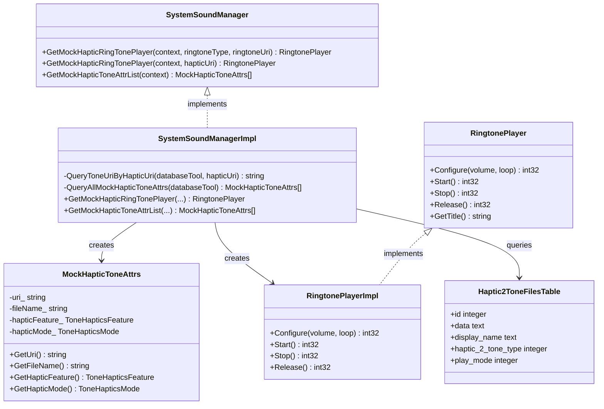
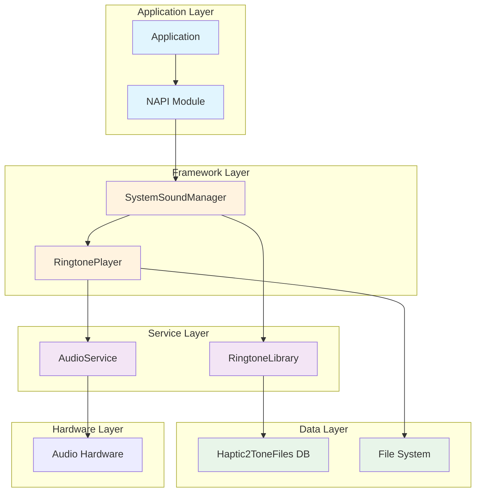
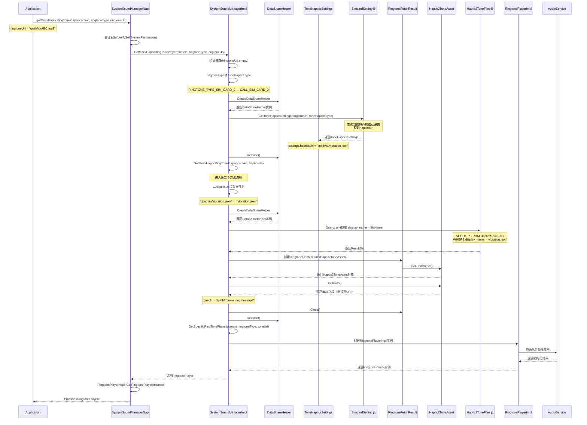
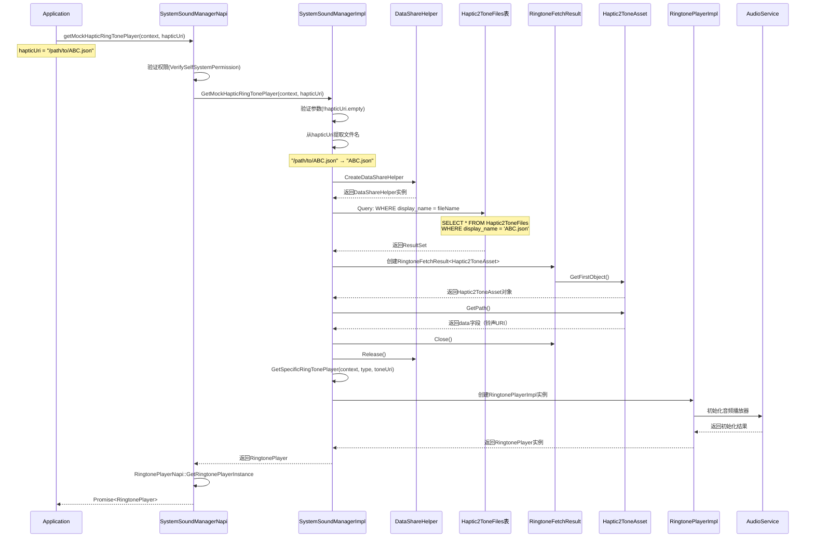
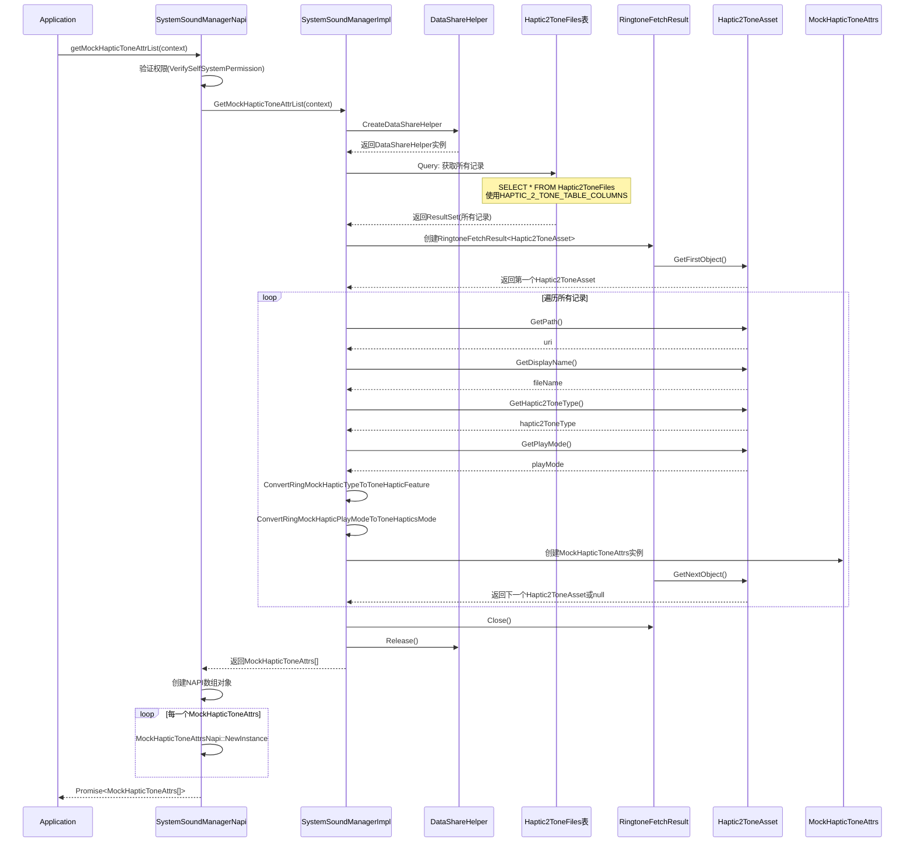
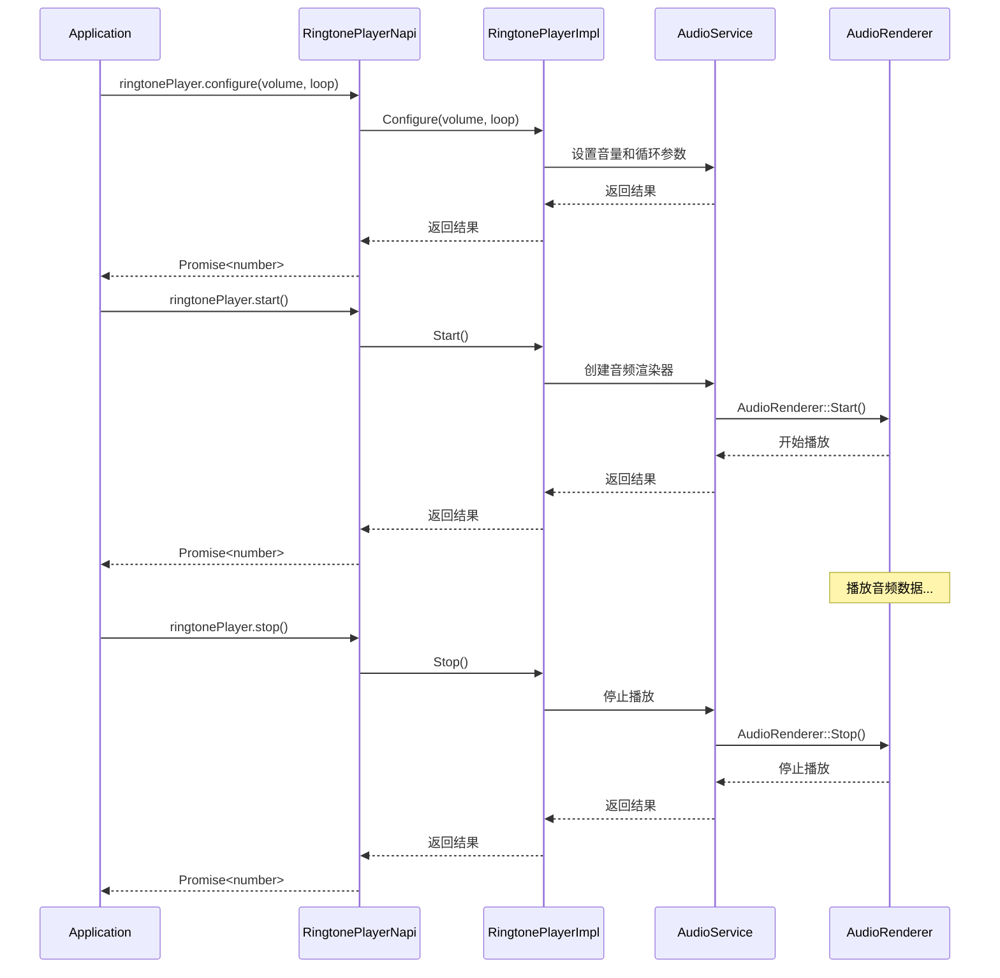

# MockHapticRingTonePlayer 功能设计文档

## 功能概述

实现一个需求：上层能够通过传入铃声文件URI或者传入震动文件URI创建一个MockHapticRingTonePlayer，通过查询震动对应的铃声资源文件实现播放模拟震动的音频的功能。

## 4+1 架构视图

### 1. 逻辑视图 (Logical View)

展示系统的主要类及其关系。



### 2. 开发视图 (Development View)

展示代码的组织结构和模块划分。

```mermaid
graph TB
    subgraph "interfaces/inner_api"
        A1[system_sound_manager.h]
        A2[mock_haptic_tone_attrs.h]
        A3[ringtone_player.h]
    }
    
    subgraph "frameworks/native"
        B1[system_sound_manager_impl.h]
        B2[system_sound_manager_impl.cpp]
        B3[ringtone_player_impl.h]
        B4[ringtone_player_impl.cpp]
    }
    
    subgraph "frameworks/js"
        C1[system_sound_manager_napi.h]
        C2[system_sound_manager_napi.cpp]
        C3[mock_haptic_tone_attrs_napi.h]
        C4[mock_haptic_tone_attrs_napi.cpp]
        C5[ringtone_player_napi.h]
        C6[ringtone_player_napi.cpp]
    }
    
    subgraph "multimedia_ringtone_library"
        D1[ringtone_db_const.h]
        D2[ringtone_proxy_uri.h]
        D3[ringtone_type.h]
    }
    
    A1 --> B1
    A2 --> B1
    A3 --> B3
    B1 --> B2
    B3 --> B4
    D1 --> B2
    D2 --> B2
    D3 --> B2
    
    A1 --> C1
    A2 --> C3
    A3 --> C5
    C1 --> C2
    C3 --> C4
    C5 --> C6
```

### 3. 进程视图 (Process View)

展示运行时的进程和线程交互。

```mermaid
flowchart TB
    subgraph "Application Process"
        AP[Application Thread]
        NP[NAPI Thread]
    end
    
    subgraph "System Service Process"
        SS[SystemSoundManager Service]
        DB[DataShare Helper]
    end
    
    subgraph "RingtoneLibrary Process"
        RL[RingtoneLibrary DataExtension]
        SQLite[SQLite Database]
    end
    
    subgraph "Audio Service Process"
        AS[Audio Service]
        AR[Audio Renderer]
    end
    
    AP --> NP : JS API Call
    NP --> SS : Native API Call
    SS --> DB : Query Request
    DB --> RL : DataShare Query
    RL --> SQLite : SQL Query
    SQLite --> RL : ResultSet
    RL --> DB : Data Return
    DB --> SS : Query Result
    SS --> AS : Create Player
    AS --> AR : Audio Playback
    AR --> AP : Audio Output
```

### 4. 物理视图 (Physical View)

展示系统的部署结构。



### 5. 场景视图 (Scenario View)

展示主要用例场景。

```mermaid
flowchart LR
    subgraph "Use Cases"
        UC1[通过铃声URI创建播放器]
        UC2[通过震动URI创建播放器]
        UC3[获取震动属性列表]
        UC4[播放铃声]
    end
    
    subgraph "Actors"
        APP[Application]
    end
    
    APP --> UC1
    APP --> UC2
    APP --> UC3
    APP --> UC4
    
    UC1 --> |返回| RP1[RingtonePlayer]
    UC2 --> |查询数据库| DB[Haptic2ToneFiles]
    DB --> |返回| RP2[RingtonePlayer]
    UC3 --> |查询数据库| DB2[Haptic2ToneFiles]
    DB2 --> |返回| AL[MockHapticToneAttrs[]]
    UC4 --> |播放音频| AUDIO[Audio Output]
```

## 时序图

### 时序图1：通过铃声URI创建播放器（修正后）



### 时序图2：通过震动URI创建播放器（修正后）



### 时序图3：获取震动属性列表（修正后）



### 时序图4：播放铃声流程



## 接口设计

### Inner API (C++)

#### SystemSoundManager 新增接口

```cpp
// 通过铃声URI创建播放器
std::shared_ptr<RingtonePlayer> GetMockHapticRingTonePlayer(
    const std::shared_ptr<AbilityRuntime::Context> &context,
    const RingtoneType ringtoneType,
    std::string &ringtoneUri);

// 通过震动URI创建播放器
std::shared_ptr<RingtonePlayer> GetMockHapticRingTonePlayer(
    const std::shared_ptr<AbilityRuntime::Context> &context,
    std::string &hapticUri);

// 获取模拟震动音效属性列表
std::vector<std::shared_ptr<MockHapticToneAttrs>> GetMockHapticToneAttrList(
    const std::shared_ptr<AbilityRuntime::Context> &context);
```

#### MockHapticToneAttrs 类

```cpp
class MockHapticToneAttrs {
public:
    MockHapticToneAttrs(std::string uri, std::string fileName,
        ToneHapticsFeature hapticFeature, ToneHapticsMode hapticMode);
    
    std::string GetUri() const;           // 震动文件URI
    std::string GetFileName() const;      // 震动文件名
    ToneHapticsFeature GetHapticFeature() const;  // 震动特性
    ToneHapticsMode GetHapticMode() const;        // 震动模式
};
```

### NAPI (JavaScript)

```typescript
interface MockHapticToneAttrs {
    uri: string;              // 震动文件URI
    fileName: string;         // 震动文件名
    hapticFeature: ToneHapticsFeature;  // STANDARD | GENTLE
    hapticMode: ToneHapticsMode;        // NONE | SYNC | NON_SYNC
}

// 通过铃声URI创建播放器（返回RingtonePlayer）
getMockHapticRingTonePlayer(context: Context, ringtoneType: RingtoneType, 
    ringtoneUri: string): Promise<RingtonePlayer>;

// 通过震动URI创建播放器（返回RingtonePlayer）
getMockHapticRingTonePlayer(context: Context, hapticUri: string): Promise<RingtonePlayer>;

// 获取模拟震动音效属性列表
getMockHapticToneAttrList(context: Context): Promise<MockHapticToneAttrs[]>;
```

## 数据库设计

### Haptic2ToneFiles 表

依赖 `multimedia_ringtone_library` 中的 `Haptic2ToneFiles` 表（PR #331 待合入）。

| 字段名 | 类型 | 说明 | MockHapticToneAttrs映射 |
|-------|------|------|------------------------|
| `id` | integer | 主键 | - |
| `data` | text | 震动文件URI | `GetUri()` |
| `size` | bigint | 文件大小 | - |
| `display_name` | text | 文件名 | `GetFileName()` |
| `title` | text | 标题 | - |
| `haptic_2_tone_type` | integer | 震动类型 | `GetHapticFeature()` |
| `source_type` | integer | 来源类型 | - |
| `date_added` | bigint | 添加时间 | - |
| `date_modified` | bigint | 修改时间 | - |
| `play_mode` | integer | 播放模式 | `GetHapticMode()` |
| `scanner_flag` | integer | 扫描标志 | - |

### 字段值映射

#### haptic_2_tone_type → ToneHapticsFeature

| 数据库值 | 枚举名 | ToneHapticsFeature |
|---------|-------|-------------------|
| 1 | `RING_MOCK_HAPTIC_AUDIO_TYPE_CLASSIC_STANDARD` | `STANDARD` |
| 2 | `RING_MOCK_HAPTIC_AUDIO_TYPE_CLASSIC_GENTLE` | `GENTLE` |

#### play_mode → ToneHapticsMode

| 数据库值 | 枚举名 | ToneHapticsMode |
|---------|-------|----------------|
| 0 | `RING_MOCK_HAPTIC_AUDIO_PLAYMODE_INVALID` | `NONE` |
| 1 | `RING_MOCK_HAPTIC_AUDIO_PLAYMODE_SYNC` | `SYNC` |
| 2 | `RING_MOCK_HAPTIC_AUDIO_PLAYMODE_CLASSIC` | `NON_SYNC` |

## 查询流程

### 流程1：根据 hapticUri 创建播放器（最终修正版）

```
输入: hapticUri = "/path/to/ABC.json"
    ↓
创建 DataShareHelper
    ↓
调用 QueryToneUriByHapticUri(databaseTool, hapticUri)
    从 hapticUri 提取文件名: "ABC.json"
    查询 Haptic2ToneFiles 表: WHERE display_name = 'ABC.json'
    使用 RingtoneFetchResult<Haptic2ToneAsset> 获取查询结果
    从 Haptic2ToneAsset 对象获取:
    - GetPath() → toneUri（铃声 URI）
    ↓
调用 QueryPlayModeByHapticUri(databaseTool, hapticUri)
    查询 Haptic2ToneFiles 表: WHERE display_name = 'ABC.json'
    使用 RingtoneFetchResult<Haptic2ToneAsset> 获取查询结果
    从 Haptic2ToneAsset 对象获取:
    - GetPlayMode() → playMode（震动模式）
    ↓
释放 DataShareHelper
    ↓
构造 ToneHapticsSettings:
    - hapticsUri = hapticUri（传入的震动 URI）
    - mode = ConvertRingMockHapticPlayModeToToneHapticsMode(playMode)
    ↓
直接构造 RingtonePlayerImpl（新构造函数，不调用 GetSpecificRingTonePlayer）
    RingtonePlayerImpl(context, sysSoundMgr, RINGTONE_TYPE_SIM_CARD_0, toneUri, settings, true)
    新构造函数逻辑:
    - 保存 mockToneHapticsSettings_ = settings
    - 保存 isMockMode_ = true
    - 不调用 GetHapticSettings（避免重复查询）
    - muteHaptics = false（永远为 false）
    - 直接调用 InitPlayer(toneUri, mockToneHapticsSettings_, options)
    ↓
返回 RingtonePlayer
    
Start() 时的特殊处理:
    ↓
检查 isMockMode_ == true
    ↓
跳过 GetHapticSettings 检查
    ↓
直接使用 mockToneHapticsSettings_ 进行播放
```

### 流程2：根据 ringtoneUri 创建播放器（修正后）

```
输入: ringtoneUri = "/path/to/ABC.mp3", ringtoneType = RINGTONE_TYPE_SIM_CARD_0
    ↓
将 ringtoneType 转换为 ToneHapticsType
    RINGTONE_TYPE_SIM_CARD_0 → CALL_SIM_CARD_0
    RINGTONE_TYPE_SIM_CARD_1 → CALL_SIM_CARD_1
    ↓
创建 DataShareHelper
    ↓
调用 GetToneHapticsSettings(databaseTool, ringtoneUri, toneHapticsType, settings)
    使用传入的 ringtoneUri 作为 toneUri 参数
    获取当前用户设置的震动 URI: settings.hapticsUri
    ↓
释放 DataShareHelper
    ↓
调用 GetMockHapticRingTonePlayer(context, settings.hapticsUri)
    该方法会：
    1. 从 hapticUri 提取文件名（如 "ABC.json"）
    2. 查询 Haptic2ToneFiles 表: WHERE display_name = 'ABC.json'
    3. 获取 data 字段（新的铃声 URI）
    4. 调用 GetSpecificRingTonePlayer 创建播放器
    ↓
返回 RingtonePlayer（播放的是查询得到的新铃声 URI）
```

### 流程3：获取震动属性列表（修正后）

```
GetMockHapticToneAttrList(context)
    ↓
查询 Haptic2ToneFiles 表获取所有记录
    使用 HAPTIC_2_TONE_TABLE_COLUMNS 作为查询列
    ↓
使用 RingtoneFetchResult<Haptic2ToneAsset> 处理结果
    ↓
遍历 Haptic2ToneAsset 对象:
    - uri ← Haptic2ToneAsset.GetPath()
    - fileName ← Haptic2ToneAsset.GetDisplayName()
    - hapticFeature ← Haptic2ToneAsset.GetHaptic2ToneType() (转换)
    - hapticMode ← Haptic2ToneAsset.GetPlayMode() (转换)
    ↓
返回 MockHapticToneAttrs[]
```

## 文件结构

### 新增文件

| 文件路径 | 说明 |
|---------|------|
| `interfaces/inner_api/native/system_sound_manager/include/mock_haptic_tone_attrs.h` | MockHapticToneAttrs 类定义 |
| `frameworks/js/system_sound_manager/include/mock_haptic_tone_attrs/mock_haptic_tone_attrs_napi.h` | NAPI 头文件 |
| `frameworks/js/system_sound_manager/src/mock_haptic_tone_attrs/mock_haptic_tone_attrs_napi.cpp` | NAPI 实现 |

### 修改文件

| 文件路径 | 修改内容 |
|---------|---------|
| `interfaces/inner_api/native/system_sound_manager/include/system_sound_manager.h` | 新增接口声明 |
| `frameworks/native/system_sound_manager/system_sound_manager_impl.h` | 新增方法声明 |
| `frameworks/native/system_sound_manager/system_sound_manager_impl.cpp` | 实现新增方法 |
| `frameworks/js/system_sound_manager/include/system_sound_manager_napi.h` | 新增 NAPI 方法声明 |
| `frameworks/js/system_sound_manager/src/system_sound_manager_napi.cpp` | 实现 NAPI 方法 |
| `frameworks/native/system_sound_manager/BUILD.gn` | 无需修改 |
| `frameworks/js/system_sound_manager/BUILD.gn` | 添加新源文件 |

## 外部依赖

依赖 `multimedia_ringtone_library` 待合入的定义（PR #331）：

### ringtone_db_const.h

```cpp
const std::string HAPTIC_2_TONE_TABLE = "Haptic2ToneFiles";
const std::string HAPTIC_2_TONE_PATH_URI = "datashare:///ringtone/Haptic2ToneFiles";

const std::string HAPTIC_2_TONE_COLUMN_ID = "id";
const std::string HAPTIC_2_TONE_COLUMN_DATA = "data";
const std::string HAPTIC_2_TONE_COLUMN_DISPLAY_NAME = "display_name";
const std::string HAPTIC_2_TONE_COLUMN_HAPTIC_2_TONE_TYPE = "haptic_2_tone_type";
const std::string HAPTIC_2_TONE_COLUMN_PLAY_MODE = "play_mode";
// ... 其他字段
```

### ringtone_proxy_uri.h

```cpp
const std::string RINGTONE_LIBRARY_PROXY_DATA_URI_HAPTIC_2_TONE =
    "datashare:///com.ohos.ringtonelibrary.ringtonelibrarydata/entry/ringtone_library/Haptic2ToneFiles?Proxy=true";
```

### ringtone_type.h

```cpp
enum RingMockHapticAudioType {
    RING_MOCK_HAPTIC_AUDIO_TYPE_INVALID = 0,
    RING_MOCK_HAPTIC_AUDIO_TYPE_CLASSIC_STANDARD = 1,
    RING_MOCK_HAPTIC_AUDIO_TYPE_CLASSIC_GENTLE = 2,
    // ... 其他类型
};

enum RingMockHapticAudioPlayMode {
    RING_MOCK_HAPTIC_AUDIO_PLAYMODE_INVALID = 0,
    RING_MOCK_HAPTIC_AUDIO_PLAYMODE_SYNC = 1,
    RING_MOCK_HAPTIC_AUDIO_PLAYMODE_CLASSIC = 2,
};
```

## 设计要点

1. **复用 RingtonePlayer**：不创建独立的 MockHapticRingTonePlayer 类，直接返回 RingtonePlayer，减少代码冗余。

2. **不重复定义常量**：所有数据库常量、URI、枚举值均使用 `multimedia_ringtone_library` 中已有的定义，避免重复定义和潜在的不一致问题。

3. **转换函数必要性**：由于 `RingMockHapticAudioType` 和 `ToneHapticsFeature` 是不同的枚举类型，需要转换函数进行值映射。

4. **文件名匹配逻辑**：震动文件和铃声文件通过 `display_name` 字段名匹配（去掉扩展名后相同）。

## 转换函数实现

```cpp
static ToneHapticsFeature ConvertRingMockHapticTypeToToneHapticFeature(int32_t dbValue)
{
    if (dbValue == RING_MOCK_HAPTIC_AUDIO_TYPE_CLASSIC_GENTLE) {
        return ToneHapticsFeature::GENTLE;
    }
    return ToneHapticsFeature::STANDARD;
}

static ToneHapticsMode ConvertRingMockHapticPlayModeToToneHapticsMode(int32_t dbValue)
{
    if (dbValue == RING_MOCK_HAPTIC_AUDIO_PLAYMODE_SYNC) {
        return ToneHapticsMode::SYNC;
    } else if (dbValue == RING_MOCK_HAPTIC_AUDIO_PLAYMODE_CLASSIC) {
        return ToneHapticsMode::NON_SYNC;
    }
    return ToneHapticsMode::NONE;
}
```

## 修正方案说明

### 问题分析

**流程1（根据 hapticUri）原实现问题：**

| 问题 | 原实现 | 影响 |
|-----|-------|------|
| 查询条件错误 | `WHERE data = hapticUri` | 完整URI无法匹配数据库中的 `data` 字段 |
| 结果获取方式错误 | `resultSet->GetString(0, toneUri)` | 未使用 `RingtoneFetchResult` 封装 |
| 查询列不完整 | 自定义 columns | 缺少必要的字段定义 |

**流程2（根据 ringtoneUri）原实现问题：**

| 问题 | 原实现 | 影响 |
|-----|-------|------|
| 直接调用播放器 | `GetSpecificRingTonePlayer(context, ringtoneType, ringtoneUri)` | 未查询当前铃声的震动设置 |
| 未获取 hapticsUri | 无震动设置查询逻辑 | 无法找到对应的模拟震动音频 |
| 缺少类型转换 | 无 RingtoneType → ToneHapticsType 转换 | 无法调用 GetToneHapticsSettings |

**流程3（获取属性列表）原实现问题：**

| 问题 | 原实现 | 影响 |
|-----|-------|------|
| 查询列不完整 | 自定义 columns | 缺少必要的字段定义 |
| 结果获取方式错误 | `resultSet->GoToNextRow()` 手动遍历 | 未使用 `RingtoneFetchResult` 封装 |
| 属性获取方式错误 | `resultSet->GetString(index)` 手动索引 | 未使用 `Haptic2ToneAsset` 对象方法 |

### 正确的查询逻辑（最终版）

**QueryPlayModeByHapticUri 方法（新增）：**

```cpp
int32_t SystemSoundManagerImpl::QueryPlayModeByHapticUri(const DatabaseTool &databaseTool,
    const std::string &hapticUri)
{
    CHECK_AND_RETURN_RET_LOG(databaseTool.isInitialized && databaseTool.dataShareHelper != nullptr,
        0, "QueryPlayModeByHapticUri: databaseTool not initialized");
    CHECK_AND_RETURN_RET_LOG(!hapticUri.empty(), 0, "QueryPlayModeByHapticUri: hapticUri is empty");

    // 从 hapticUri 提取文件名
    // 例如: "/path/to/ABC.json" → "ABC.json"
    std::string fileName;
    size_t lastSlashPos = hapticUri.find_last_of('/');
    if (lastSlashPos != std::string::npos) {
        fileName = hapticUri.substr(lastSlashPos + 1);
    } else {
        fileName = hapticUri;
    }

    std::string queryUriStr = databaseTool.isProxy ?
        RINGTONE_LIBRARY_PROXY_DATA_URI_HAPTIC_2_TONE +
        "&user=" + std::to_string(SystemSoundManagerUtils::GetCurrentUserId()) :
        HAPTIC_2_TONE_PATH_URI;
    Uri queryUri(queryUriStr);

    DataShare::DatashareBusinessError businessError;
    DataShare::DataSharePredicates predicates;
    predicates.EqualTo(HAPTIC_2_TONE_COLUMN_DISPLAY_NAME, fileName);

    auto resultSet = databaseTool.dataShareHelper->Query(queryUri, predicates,
        HAPTIC_2_TONE_TABLE_COLUMNS, &businessError);
    auto results = make_unique<RingtoneFetchResult<Haptic2ToneAsset>>(move(resultSet));
    CHECK_AND_RETURN_RET_LOG(results != nullptr, 0, "query failed, ringtone library error.");

    unique_ptr<Haptic2ToneAsset> haptic2ToneAsset = results->GetFirstObject();
    CHECK_AND_RETURN_RET_LOG(haptic2ToneAsset != nullptr, 0,
        "QueryPlayModeByHapticUri: no data in ringtone library for fileName %{public}s", fileName.c_str());

    int32_t playMode = haptic2ToneAsset->GetPlayMode();
    results->Close();
    MEDIA_LOGI("QueryPlayModeByHapticUri: found playMode %{public}d for fileName %{public}s",
        playMode, fileName.c_str());
    return playMode;
}
```

**GetMockHapticRingTonePlayer(context, hapticUri) 方法（最终修正版）：**

```cpp
std::shared_ptr<RingtonePlayer> SystemSoundManagerImpl::GetMockHapticRingTonePlayer(
    const std::shared_ptr<AbilityRuntime::Context> &context, std::string &hapticUri)
{
    MEDIA_LOGI("GetMockHapticRingTonePlayer: hapticUri %{public}s", hapticUri.c_str());
    CHECK_AND_RETURN_RET_LOG(!hapticUri.empty(), nullptr, "GetMockHapticRingTonePlayer: hapticUri is empty");

    // 修正点1：创建 DataShareHelper
    bool isProxy = false;
    std::shared_ptr<DataShare::DataShareHelper> dataShareHelper;
    SystemSoundManagerUtils::CreateDataShareHelper(STORAGE_MANAGER_MANAGER_ID, isProxy, dataShareHelper);
    CHECK_AND_RETURN_RET_LOG(dataShareHelper != nullptr, nullptr,
        "Create dataShare failed, datashare or ringtone library error.");
    DatabaseTool databaseTool = {true, isProxy, dataShareHelper};

    // 修正点2：调用 QueryToneUriByHapticUri 获取 toneUri
    std::string toneUri = QueryToneUriByHapticUri(databaseTool, hapticUri);

    // 修正点3：调用 QueryPlayModeByHapticUri 获取 playMode
    int32_t playMode = QueryPlayModeByHapticUri(databaseTool, hapticUri);

    // 修正点4：Release DataShareHelper
    dataShareHelper->Release();

    CHECK_AND_RETURN_RET_LOG(!toneUri.empty(), nullptr, "GetMockHapticRingTonePlayer: toneUri is empty");

    // 修正点5：构造 ToneHapticsSettings
    ToneHapticsSettings settings;
    settings.hapticsUri = hapticUri;  // 传入的震动 URI
    settings.mode = ConvertRingMockHapticPlayModeToToneHapticsMode(playMode);  // play_mode 转换

    // 修正点6：直接构造 RingtonePlayerImpl（不调用 GetSpecificRingTonePlayer）
    std::shared_ptr<RingtonePlayer> ringtonePlayer = std::make_shared<RingtonePlayerImpl>(
        context, *this, RINGTONE_TYPE_SIM_CARD_0, toneUri, settings, true);  // isMockMode = true
    CHECK_AND_RETURN_RET_LOG(ringtonePlayer != nullptr, nullptr,
        "Failed to create ringtone player object");
    return ringtonePlayer;
}
```

**RingtonePlayerImpl 新构造函数（新增）：**

```cpp
// ringtone_player_impl.h 新增声明
class RingtonePlayerImpl : public RingtonePlayer {
public:
    // 现有构造函数
    RingtonePlayerImpl(const std::shared_ptr<AbilityRuntime::Context> &context,
        SystemSoundManagerImpl &sysSoundMgr, RingtoneType type);
    RingtonePlayerImpl(const std::shared_ptr<AbilityRuntime::Context> &context,
        SystemSoundManagerImpl &sysSoundMgr, const RingtoneType type, std::string &ringtoneUri);

    // 新增构造函数
    RingtonePlayerImpl(const std::shared_ptr<AbilityRuntime::Context> &context,
        SystemSoundManagerImpl &sysSoundMgr, const RingtoneType type, std::string &ringtoneUri,
        ToneHapticsSettings &mockSettings, bool isMockMode);

private:
    // 新增私有属性
    ToneHapticsSettings mockToneHapticsSettings_;  // Mock 震动设置
    bool isMockMode_ = false;                       // 是否为 Mock 模式
};

// ringtone_player_impl.cpp 新增实现
RingtonePlayerImpl::RingtonePlayerImpl(const shared_ptr<Context> &context,
    SystemSoundManagerImpl &sysSoundMgr, const RingtoneType type,
    string &ringtoneUri, ToneHapticsSettings &mockSettings, bool isMockMode)
    : volume_(HIGH_VOL),
      loop_(false),
      context_(context),
      systemSoundMgr_(sysSoundMgr),
      type_(type),
      specifyRingtoneUri_(ringtoneUri),
      mockToneHapticsSettings_(mockSettings),  // 新增：保存 Mock 震动设置
      isMockMode_(isMockMode)                   // 新增：保存 Mock 模式标识
{
    if (!InitDatabaseTool()) {
        MEDIA_LOGE("Failed to init DatabaseTool!");
        return;
    }

    audioHapticManager_ = AudioHapticManagerFactory::CreateAudioHapticManager();
    CHECK_AND_RETURN_LOG(audioHapticManager_ != nullptr, "Failed to get audio haptic manager");

    AudioHapticPlayerOptions options = {false, false};  // muteHaptics = false（永远为 false）
    // 关键：使用传入的 mockSettings，不调用 GetHapticSettings（避免重复查询）
    InitPlayer(specifyRingtoneUri_, mockToneHapticsSettings_, options);
    ReleaseDatabaseTool();
}
```

**Start() 方法 Mock 模式特殊处理：**

```cpp
int32_t RingtonePlayerImpl::Start(const HapticStartupMode startupMode)
{
    // 新增：如果是 Mock 模式，跳过 GetHapticSettings 检查
    if (isMockMode_) {
        // 直接使用保存的 mockToneHapticsSettings_
        // 不调用 GetHapticSettings，直接进行播放
        // ... 现有 Start 逻辑，跳过震动设置重新检查
    } else {
        // 现有逻辑：调用 GetHapticSettings 检查
        // ... 现有 Start 逻辑
    }
}
```

**GetMockHapticRingTonePlayer(context, ringtoneType, ringtoneUri) 方法修正：**

```cpp
std::shared_ptr<RingtonePlayer> SystemSoundManagerImpl::GetMockHapticRingTonePlayer(
    const std::shared_ptr<AbilityRuntime::Context> &context, const RingtoneType ringtoneType,
    std::string &ringtoneUri)
{
    MEDIA_LOGI("GetMockHapticRingTonePlayer: ringtoneUri %{public}s, ringtoneType %{public}d",
        ringtoneUri.c_str(), ringtoneType);
    CHECK_AND_RETURN_RET_LOG(!ringtoneUri.empty(), nullptr, "GetMockHapticRingTonePlayer: ringtoneUri is empty");

#ifdef SUPPORT_VIBRATOR
    // 修正点1：将 ringtoneType 转换为 ToneHapticsType
    ToneHapticsType toneHapticsType = CALL_SIM_CARD_0;
    if (ringtoneType == RINGTONE_TYPE_SIM_CARD_1) {
        toneHapticsType = CALL_SIM_CARD_1;
    }

    // 修正点2：创建 DataShareHelper
    bool isProxy = false;
    std::shared_ptr<DataShare::DataShareHelper> dataShareHelper;
    SystemSoundManagerUtils::CreateDataShareHelper(STORAGE_MANAGER_MANAGER_ID, isProxy, dataShareHelper);
    CHECK_AND_RETURN_RET_LOG(dataShareHelper != nullptr, nullptr,
        "Create dataShare failed, datashare or ringtone library error.");
    DatabaseTool databaseTool = {true, isProxy, dataShareHelper};

    // 修正点3：调用 GetToneHapticsSettings 获取当前铃声的震动设置
    ToneHapticsSettings settings;
    int32_t result = GetToneHapticsSettings(databaseTool, ringtoneUri, toneHapticsType, settings);
    dataShareHelper->Release();

    if (result != SUCCESS || settings.hapticsUri.empty()) {
        MEDIA_LOGE("GetMockHapticRingTonePlayer: GetToneHapticsSettings failed or hapticsUri is empty");
        return nullptr;
    }

    // 修正点4：使用获取到的 hapticsUri 调用第二个方法
    std::string hapticUri = settings.hapticsUri;
    return GetMockHapticRingTonePlayer(context, hapticUri);
#else
    // 不支持震动时，直接使用传入的 ringtoneUri 创建播放器
    return GetSpecificRingTonePlayer(context, ringtoneType, ringtoneUri);
#endif
}
```

**QueryToneUriByHapticUri 方法修正：**

```cpp
std::string SystemSoundManagerImpl::QueryToneUriByHapticUri(const DatabaseTool &databaseTool,
    const std::string &hapticUri)
{
    CHECK_AND_RETURN_RET_LOG(databaseTool.isInitialized && databaseTool.dataShareHelper != nullptr,
        "", "QueryToneUriByHapticUri: databaseTool not initialized");
    CHECK_AND_RETURN_RET_LOG(!hapticUri.empty(), "", "QueryToneUriByHapticUri: hapticUri is empty");

    // 修正点1：从 hapticUri 提取文件名
    // 例如: "/path/to/ABC.json" → "ABC.json"
    std::string fileName;
    size_t lastSlashPos = hapticUri.find_last_of('/');
    if (lastSlashPos != std::string::npos) {
        fileName = hapticUri.substr(lastSlashPos + 1);
    } else {
        fileName = hapticUri;
    }

    std::string queryUriStr = databaseTool.isProxy ?
        RINGTONE_LIBRARY_PROXY_DATA_URI_HAPTIC_2_TONE +
        "&user=" + std::to_string(SystemSoundManagerUtils::GetCurrentUserId()) :
        HAPTIC_2_TONE_PATH_URI;
    Uri queryUri(queryUriStr);

    DataShare::DatashareBusinessError businessError;
    DataShare::DataSharePredicates predicates;
    
    // 修正点2：使用 display_name 字段匹配文件名
    predicates.EqualTo(HAPTIC_2_TONE_COLUMN_DISPLAY_NAME, fileName);

    // 修正点3：使用 HAPTIC_2_TONE_TABLE_COLUMNS 标准列定义
    auto resultSet = databaseTool.dataShareHelper->Query(queryUri, predicates,
        HAPTIC_2_TONE_TABLE_COLUMNS, &businessError);
    
    // 修正点4：使用 RingtoneFetchResult<Haptic2ToneAsset> 封装结果
    auto results = make_unique<RingtoneFetchResult<Haptic2ToneAsset>>(move(resultSet));
    CHECK_AND_RETURN_RET_LOG(results != nullptr, "", "query failed, ringtone library error.");

    unique_ptr<Haptic2ToneAsset> haptic2ToneAsset = results->GetFirstObject();
    CHECK_AND_RETURN_RET_LOG(haptic2ToneAsset != nullptr, "", 
        "QueryToneUriByHapticUri: no data in ringtone library for fileName %{public}s", fileName.c_str());

    // 修正点5：从 Haptic2ToneAsset 对象获取 data 字段（铃声URI）
    std::string toneUri = haptic2ToneAsset->GetPath();
    results->Close();
    MEDIA_LOGI("QueryToneUriByHapticUri: found toneUri %{public}s for fileName %{public}s", 
        toneUri.c_str(), fileName.c_str());
    return toneUri;
}
```

**QueryAllMockHapticToneAttrs 方法修正：**

```cpp
std::vector<std::shared_ptr<MockHapticToneAttrs>> SystemSoundManagerImpl::QueryAllMockHapticToneAttrs(
    const DatabaseTool &databaseTool)
{
    std::vector<std::shared_ptr<MockHapticToneAttrs>> mockHapticToneAttrsArray;
    CHECK_AND_RETURN_RET_LOG(databaseTool.isInitialized && databaseTool.dataShareHelper != nullptr,
        mockHapticToneAttrsArray, "QueryAllMockHapticToneAttrs: databaseTool not initialized");

    std::string queryUriStr = databaseTool.isProxy ?
        RINGTONE_LIBRARY_PROXY_DATA_URI_HAPTIC_2_TONE +
        "&user=" + std::to_string(SystemSoundManagerUtils::GetCurrentUserId()) :
        HAPTIC_2_TONE_PATH_URI;
    Uri queryUri(queryUriStr);

    DataShare::DatashareBusinessError businessError;
    DataShare::DataSharePredicates predicates;

    // 修正点1：使用 HAPTIC_2_TONE_TABLE_COLUMNS 标准列定义
    auto resultSet = databaseTool.dataShareHelper->Query(queryUri, predicates,
        HAPTIC_2_TONE_TABLE_COLUMNS, &businessError);
    
    // 修正点2：使用 RingtoneFetchResult<Haptic2ToneAsset> 封装结果
    auto results = make_unique<RingtoneFetchResult<Haptic2ToneAsset>>(move(resultSet));
    CHECK_AND_RETURN_RET_LOG(results != nullptr, mockHapticToneAttrsArray,
        "QueryAllMockHapticToneAttrs: query failed, ringtone library error.");

    // 修正点3：使用 GetFirstObject/GetNextObject 遍历结果
    unique_ptr<Haptic2ToneAsset> haptic2ToneAsset = results->GetFirstObject();
    while (haptic2ToneAsset != nullptr) {
        // 修正点4：从 Haptic2ToneAsset 对象获取属性
        std::string uri = haptic2ToneAsset->GetPath();
        std::string fileName = haptic2ToneAsset->GetDisplayName();
        int32_t haptic2ToneType = haptic2ToneAsset->GetHaptic2ToneType();
        int32_t playMode = haptic2ToneAsset->GetPlayMode();
        
        ToneHapticsFeature hapticFeature = ConvertRingMockHapticTypeToToneHapticFeature(haptic2ToneType);
        ToneHapticsMode hapticMode = ConvertRingMockHapticPlayModeToToneHapticsMode(playMode);
        
        auto mockHapticToneAttrs = std::make_shared<MockHapticToneAttrs>(uri, fileName, hapticFeature, hapticMode);
        mockHapticToneAttrsArray.push_back(mockHapticToneAttrs);
        haptic2ToneAsset = results->GetNextObject();
    }
    
    results->Close();
    MEDIA_LOGI("QueryAllMockHapticToneAttrs: got %{public}zu records", mockHapticToneAttrsArray.size());
    return mockHapticToneAttrsArray;
}
```

### HAPTIC_2_TONE_TABLE_COLUMNS 定义

来自 `ringtone_db_const.h`（PR #331）：

```cpp
std::vector<std::string> HAPTIC_2_TONE_TABLE_COLUMNS = {
    HAPTIC_2_TONE_COLUMN_ID,           // 0
    HAPTIC_2_TONE_COLUMN_DATA,         // 1 - 震动/铃声URI
    HAPTIC_2_TONE_COLUMN_SIZE,         // 2
    HAPTIC_2_TONE_COLUMN_DISPLAY_NAME, // 3 - 文件名
    HAPTIC_2_TONE_COLUMN_TITLE,        // 4
    HAPTIC_2_TONE_COLUMN_HAPTIC_2_TONE_TYPE,  // 5 - 震动类型
    HAPTIC_2_TONE_COLUMN_SOURCE_TYPE,  // 6
    HAPTIC_2_TONE_COLUMN_DATE_ADDED,   // 7
    HAPTIC_2_TONE_COLUMN_DATE_MODIFIED, // 8
    HAPTIC_2_TONE_COLUMN_PLAY_MODE,    // 9 - 播放模式
    HAPTIC_2_TONE_COLUMN_SCANNER_FLAG  // 10
};
```

### Haptic2ToneAsset 类方法

来自 `haptic_2_tone_asset.h`（PR #331）：

```cpp
class Haptic2ToneAsset {
public:
    int32_t GetId() const;
    const std::string &GetPath() const;           // 返回 data 字段
    int64_t GetSize() const;
    const std::string &GetDisplayName() const;   // 返回 display_name 字段
    const std::string &GetTitle() const;
    int32_t GetHaptic2ToneType() const;           // 返回 haptic_2_tone_type 字段
    int32_t GetSourceType() const;
    int64_t GetDateAdded() const;
    int64_t GetDateModified() const;
    int32_t GetPlayMode() const;                  // 返回 play_mode 字段
    int32_t GetScannerFlag() const;
};
```

### 修正要点总结（最终版）

**流程1（根据 hapticUri）修正要点：**

| 修正点 | 说明 |
|-------|------|
| 文件名提取 | 从完整 URI 中提取文件名（如 `ABC.json`）用于查询 |
| 查询条件 | 使用 `display_name` 字段匹配文件名，而非 `data` 字段匹配完整 URI |
| 查询列 | 使用 `HAPTIC_2_TONE_TABLE_COLUMNS` 标准列定义 |
| 结果封装 | 使用 `RingtoneFetchResult<Haptic2ToneAsset>` 封装 ResultSet |
| 属性获取 | 通过 `Haptic2ToneAsset` 对象方法获取属性值，而非手动索引 |
| 新查询方法 | 新增 `QueryPlayModeByHapticUri` 方法，获取 `play_mode` 字段 |
| 不调用 GetSpecificRingTonePlayer | 直接构造 `RingtonePlayerImpl`，避免重复查询 |
| ToneHapticsSettings 构造 | 在方法内构造，`hapticsUri` 为传入值，`mode` 从 `play_mode` 转换 |
| 新构造函数 | 新增带 `mockSettings` 和 `isMockMode` 参数的构造函数 |
| 不调用 GetHapticSettings | 新构造函数直接使用传入的 `mockSettings`，避免重复查询 |
| muteHaptics 固定为 false | 新构造函数中 `muteHaptics` 永远为 `false` |
| 保存 Mock 属性 | 新增 `mockToneHapticsSettings_` 和 `isMockMode_` 私有属性 |
| Start() Mock 处理 | Mock 模式下跳过 `GetHapticSettings` 检查，直接使用保存的设置 |

**流程2（根据 ringtoneUri）修正要点：**

| 修正点 | 说明 |
|-------|------|
| 类型转换 | 将 `RingtoneType` 转换为 `ToneHapticsType`（不新增函数，直接判断） |
| 震动设置获取 | 调用 `GetToneHapticsSettings` 获取当前铃声对应的震动 URI |
| 参数传递 | 使用传入的 `ringtoneUri` 作为 `toneUri` 参数 |
| 方法调用 | 获取 `hapticsUri` 后调用第二个 `GetMockHapticRingTonePlayer` 方法 |
| SUPPORT_VIBRATOR | 震动相关逻辑在 `SUPPORT_VIBRATOR` 宏保护下执行 |

**流程3（获取属性列表）修正要点：**

| 修正点 | 说明 |
|-------|------|
| 查询列 | 使用 `HAPTIC_2_TONE_TABLE_COLUMNS` 标准列定义 |
| 结果封装 | 使用 `RingtoneFetchResult<Haptic2ToneAsset>` 封装 ResultSet |
| 遍历方式 | 使用 `GetFirstObject()` + `GetNextObject()` 遍历结果 |
| 属性获取 | 从 `Haptic2ToneAsset` 对象方法获取属性值 |

## 后续工作

1. 等待 `multimedia_ringtone_library` PR #331 合入
2. 验证数据库查询逻辑的正确性
3. 编写单元测试覆盖新增接口

## Mock 模式 rendererFlags 设置

当 `isMockMode_` 为 true 时，需要在创建 AudioHapticPlayer 时设置 `rendererFlags` 为 `AUDIO_FLAG_VKB_NORMAL`，以支持 VKB（Virtual Key Board）音频播放模式。

### 数据传递链路

通过传递 `isMockMode` 标识，在 `AudioHapticPlayerImpl::LoadPlayer` 中根据 `isMockMode_` 判断是否设置 `rendererFlags`：

```
RingtonePlayerImpl (isMockMode_)
       ↓ SetMockMode(sourceId_, true)
AudioHapticManagerImpl
       ↓ 存储到 AudioHapticPlayerInfo.isMockMode_
       ↓ CreatePlayer → AudioHapticPlayerParam.isMockMode
AudioHapticPlayerImpl
       ↓ SetPlayerParam → isMockMode_
       ↓ LoadPlayer: if (isMockMode_) rendererFlags = AUDIO_FLAG_VKB_NORMAL
       ↓ CreateAudioHapticSound(..., rendererFlags)
AudioHapticSoundNormalImpl
       ↓ 构造函数保存 rendererFlags_
       ↓ ResetAVPlayer → Format.PutIntValue(PlayerKeys::RENDERER_FLAG, rendererFlags_)
AVPlayer
```

### 修改文件列表

| 文件路径 | 修改内容 |
|---------|---------|
| `interfaces/inner_api/native/audio_haptic/include/audio_haptic_player.h` | `AudioHapticPlayerParam` 添加 `isMockMode` 字段 |
| `interfaces/inner_api/native/audio_haptic/include/audio_haptic_manager.h` | 添加 `SetMockMode` 虚方法声明 |
| `interfaces/inner_api/native/audio_haptic/include/audio_haptic_sound.h` | `CreateAudioHapticSound` 添加 `rendererFlags` 参数 |
| `frameworks/native/audio_haptic/audio_haptic_manager_impl.h` | `AudioHapticPlayerInfo` 添加 `isMockMode_` 成员 |
| `frameworks/native/audio_haptic/audio_haptic_manager_impl.cpp` | 实现 `SetMockMode` 方法 |
| `frameworks/native/audio_haptic/audio_haptic_player_impl.h` | 添加 `isMockMode_` 成员 |
| `frameworks/native/audio_haptic/audio_haptic_player_impl.cpp` | `SetPlayerParam` 保存 `isMockMode_`，`LoadPlayer` 根据 `isMockMode_` 设置 `rendererFlags` |
| `frameworks/native/audio_haptic/audio_haptic_sound_normal_impl.h` | 构造函数添加 `rendererFlags` 参数 |
| `frameworks/native/audio_haptic/audio_haptic_sound_normal_impl.cpp` | `ResetAVPlayer` 中设置 `PlayerKeys::RENDERER_FLAG` |
| `frameworks/native/system_sound_manager/ringtone_player/ringtone_player_impl.cpp` | `InitPlayer` 中 Mock 模式调用 `SetMockMode` |

### 关键代码实现

**ringtone_player_impl.cpp InitPlayer 修改：**

```cpp
sourceId_ = RegisterSource(audioUri, settings.hapticsUri);
CHECK_AND_RETURN_LOG(sourceId_ != -1, "Failed to register source for audio haptic manager");
(void)audioHapticManager_->SetAudioLatencyMode(sourceId_, AUDIO_LATENCY_MODE_NORMAL);
(void)audioHapticManager_->SetStreamUsage(sourceId_, AudioStandard::StreamUsage::STREAM_USAGE_VOICE_RINGTONE);

if (isMockMode_) {
    (void)audioHapticManager_->SetMockMode(sourceId_, true);
}
```

**audio_haptic_player_impl.cpp LoadPlayer 修改：**

```cpp
void AudioHapticPlayerImpl::LoadPlayer()
{
    int32_t rendererFlags = 0;
    if (isMockMode_) {
        rendererFlags = AudioStandard::AUDIO_FLAG_VKB_NORMAL;
    }
    audioHapticSound_ = AudioHapticSound::CreateAudioHapticSound(
        latencyMode_, audioSource_, muteAudio_, streamUsage_, parallelPlayFlag_, rendererFlags);
    // ...
}
```

**audio_haptic_sound_normal_impl.cpp ResetAVPlayer 修改：**

```cpp
Format format;
format.PutIntValue(PlayerKeys::CONTENT_TYPE, AudioStandard::CONTENT_TYPE_UNKNOWN);
format.PutIntValue(PlayerKeys::STREAM_USAGE, streamUsage_);
if (rendererFlags_ != 0) {
    format.PutIntValue(PlayerKeys::RENDERER_FLAG, rendererFlags_);
}
ret = avPlayer_->SetParameter(format);
```

### 设计要点

1. **传递 isMockMode 而非 rendererFlags**：通过传递 `isMockMode` 标识，在 `AudioHapticPlayerImpl` 中根据标识判断是否设置 `rendererFlags`，便于后续扩展使用 `isMockMode`。
2. **不影响普通模式**：当 `isMockMode_` 为 false 时，`rendererFlags` 保持默认值 0，不修改任何现有逻辑。
3. **不修改 LowLatency 模式**：本次修改仅涉及 `AudioHapticSoundNormalImpl`，不影响 `AudioHapticSoundLowLatencyImpl`。
4. **条件设置**：在 `ResetAVPlayer` 中只有当 `rendererFlags_ != 0` 时才设置 `PlayerKeys::RENDERER_FLAG`，避免影响默认行为。
5. **便于后续扩展**：`isMockMode_` 保存在 `AudioHapticPlayerImpl` 中，后续可在播放器层使用此标识进行其他特殊处理。